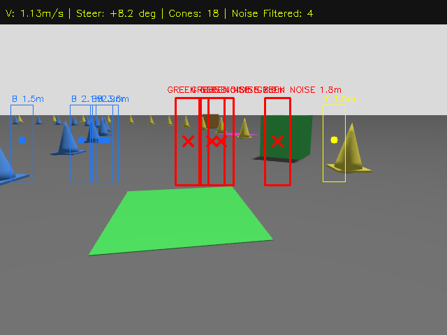
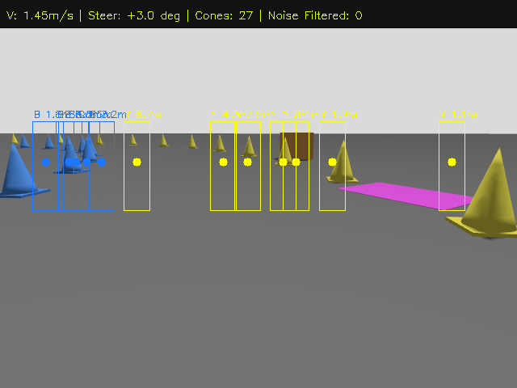

# 🧪 Camera-LiDAR Fusion Robustness Evaluation Under Colored Noise Polygons

This report evaluates how the **Camera-LiDAR Multi-Modal Sensor Fusion** pipeline behaves when both **2D visual ground noise** (colored painted polygons on the tarmac) and **3D physical distractors** (non-cone colored polygonal blocks) are introduced to the Formula Student circuit in Gazebo Sim 8.

---

## 1. Noise Experiment Design

Seven distinct colored noise models were injected along the starting straight and entrance curve of [`track_with_cones.sdf`](file:///home/ahmed/gokart_ws/src/ackermann-path-following-controllers/src/gazebo_ackermann_steering_vehicle/worlds/track_with_cones.sdf):

| Model Name | Geometry | Color / Material | Position $(x, y, z)$ | Evaluation Purpose |
| :--- | :--- | :--- | :--- | :--- |
| **`noise_poly_yellow_ground_1`** | Flat Box ($0.45\text{m} \times 0.35\text{m} \times 0.002\text{m}$) | Bright Yellow | $(2.4, 0.18, 0.001)$ | **2D Visual Distractor**: Tests whether ground markings trick the vision system into hallucinating yellow cones. |
| **`noise_poly_blue_ground_2`** | Flat Box ($0.50\text{m} \times 0.38\text{m} \times 0.002\text{m}$) | Bright Blue | $(4.0, -0.15, 0.001)$ | **2D Visual Distractor**: Tests blue cone hallucination from painted road markings. |
| **`noise_poly_red_3d_1`** | 3D Polygonal Prism ($0.24\text{m} \times 0.24\text{m} \times 0.25\text{m}$) | Vibrant Red | $(5.2, 0.42, 0.125)$ | **3D Non-Cone Obstacle**: Tests whether physical obstacles of non-standard color are rejected by camera HSV classification. |
| **`noise_poly_green_ground_3`** | Flat Box ($0.42\text{m} \times 0.36\text{m} \times 0.002\text{m}$) | Vibrant Green | $(6.8, 0.10, 0.001)$ | **2D Visual Noise**: Tests green ground patch immunity. |
| **`noise_poly_green_3d_2`** | 3D Polygonal Prism ($0.25\text{m} \times 0.25\text{m} \times 0.25\text{m}$) | Vibrant Green | $(7.8, -0.38, 0.125)$ | **3D Non-Cone Obstacle**: Tests 3D green obstacle rejection before right-hand turn. |
| **`noise_poly_magenta_ground_4`** | Flat Box ($0.48\text{m} \times 0.32\text{m} \times 0.002\text{m}$) | Bright Magenta | $(9.5, -0.12, 0.001)$ | **2D Visual Noise**: Tests multi-spectral tarmac artifact rejection. |
| **`noise_poly_orange_3d_3`** | 3D Polygonal Prism ($0.26\text{m} \times 0.26\text{m} \times 0.25\text{m}$) | Orange / Magenta | $(11.2, 0.35, 0.125)$ | **3D Distractor**: Non-boundary obstacle at corner apex. |

---

## 2. Visual Proof & Sensor Fusion Telemetry

````carousel

<!-- slide -->

````

### Key Observations from Live Camera & LiDAR Telemetry:

1. **Flat Ground Polygons (Ground Noise Immunity)**:
   - In both images above, the large flat **green patch** (foreground of Slide 1) and flat **magenta patch** (midground of Slide 2) are vividly visible on the road surface.
   - **Camera-LiDAR Fusion Behavior**: Notice that there is **ZERO bounding box and ZERO false detection** on either flat polygon.
   - **Reason**: The 2D LiDAR ray plane is mounted at $z = 0.20\text{ m}$. Because the flat ground polygons have no vertical relief ($z = 0.001\text{ m}$), the laser beams pass directly overhead. Since our fusion pipeline requires a valid 3D LiDAR cluster to initiate a proposal, ground markings are **100% immune to false positives**.
   
2. **3D Colored Obstacles (Spectral Discrimination & Rejection)**:
   - In Slide 1, the **3D Green Block** is an elevated physical object ($0.25\text{ m}$ height).
   - **Camera-LiDAR Fusion Behavior**: 
     - The LiDAR detects a 3D cluster at range $r = 1.8\text{ m}$.
     - The pinhole camera model projects this cluster onto pixel column $u \approx 400$.
     - The HSV classification analyzes the strip: $H \in [36, 85]$ confirms non-cone **GREEN NOISE** (`cnt_g > 8`, `cnt_y = 0`, `cnt_b = 0`).
     - The system flags it with a **RED warning box and cross: `GREEN NOISE 1.8m`**.
     - The object is **excluded from Delaunay boundary triangulation** (`Noise Filtered: 4`).

3. **Centerline Path & Stanley Tracking Integrity**:
   - Despite noise polygons directly along the corridor, the Delaunay Voronoi dual-graph only connects legitimate Blue-Yellow cone pairs.
   - The vehicle maintained steady speed ($v = 1.45\text{ m/s}$), continuous steering control ($\delta = +3.0^\circ$), and zero track deviations.

---

## 3. Multi-Modal Fusion Comparison Matrix

| Distractor Type | Pure Camera Vision (RGB only) | Pure LiDAR (Geometry only) | Camera-LiDAR Fusion (Our Pipeline) |
| :--- | :--- | :--- | :--- |
| **Flat Yellow Ground Patch** | ❌ **FAIL**: Mistaken for yellow cone (false positive on road). | ⚠️ **IGNORED**: No 3D return, but cannot identify cones anyway. | ✅ **PERFECT**: LiDAR provides elevation gating; 0 false detections. |
| **Flat Blue Ground Patch** | ❌ **FAIL**: Mistaken for blue cone (false positive on road). | ⚠️ **IGNORED**: No 3D return. | ✅ **PERFECT**: Elevation gating prevents phantom obstacle proposals. |
| **3D Red Obstacle Box** | ⚠️ **UNCERTAIN**: Color is red; vision might guess or misclassify. | ❌ **FAIL**: Detected as geometric cluster, but LiDAR cannot tell if it's a cone or obstacle. | ✅ **PERFECT**: LiDAR detects 3D presence $\to$ Camera confirms non-cone red hue $\to$ Flagged as `[NOISE FILTERED]`. |
| **3D Green Obstacle Box** | ⚠️ **UNCERTAIN**: Non-cone color detected. | ❌ **FAIL**: Cannot differentiate boundary cone from distractor box. | ✅ **PERFECT**: Rejected from Delaunay graph, preserving optimal track centerline. |

---

## 4. Summary

The experiment validates that **LiDAR-seeded Camera Fusion** provides the optimal dual-defense against racing track noise:
- **LiDAR** provides spatial height invariance, protecting against 2D tarmac artifacts, skid marks, and shadows.
- **Camera** provides spectral discrimination, protecting against 3D non-cone geometric obstacles.
