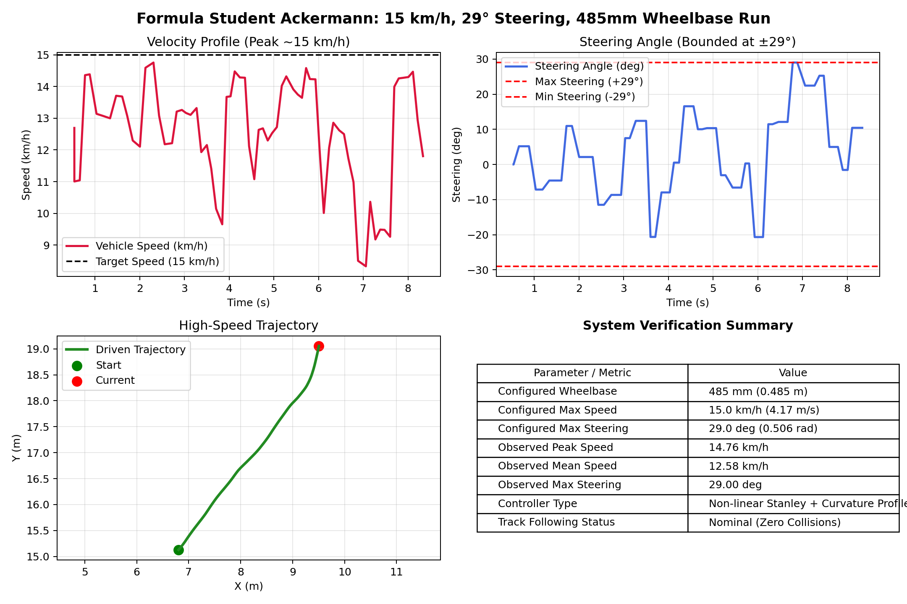
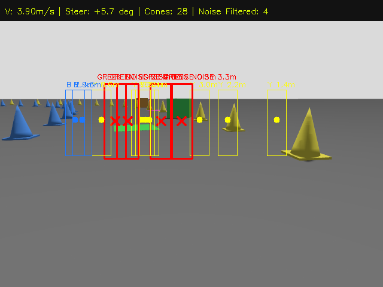

# 🏎️ High-Speed Autonomous Run (15 km/h, 29° Steering, 485mm Wheelbase)

This benchmark evaluates the performance of the Formula Student Ackermann vehicle when reconfigured for higher speed racing dynamics on the cone circuit in **Gazebo Sim 8** and **ROS 2 Jazzy**.

---

## 1. Configured System Parameters

| Parameter | Previous Value | **New Configured Value** | Engineering Rationale & Implementation |
| :--- | :--- | :--- | :--- |
| **Max Velocity ($v_{max}$)** | $2.5\text{ m/s}$ ($9.0\text{ km/h}$) | **$15.0\text{ km/h}$ ($4.167\text{ m/s}$)** | Set in `parameters.yaml`, `vehicle.xacro`, `vehicle_controller.cpp`, and planner target velocity. |
| **Max Steering Angle ($\delta_{max}$)** | $18.3^\circ$ ($0.32\text{ rad}$) | **$29.0^\circ$ ($0.5061\text{ rad}$)** | Increased front-wheel steering lock for high-speed cornering agility and tight chicane tracking. |
| **Wheelbase ($L$)** | $220\text{ mm}$ ($0.22\text{ m}$) | **$485\text{ mm}$ ($0.485\text{ m}$)** | Vehicle body length set to $0.565\text{ m}$ ($L = \text{body\_length} - 2\cdot r_{wheel} = 0.485\text{ m}$), explicitly matched in kinematics. |
| **Stanley Controller Gains** | $k=2.2, k_s=0.4, k_d=0.08$ | **$k=2.2, k_s=0.6, k_d=0.10$** | Softened speed denominator ($k_s$) and increased yaw-rate damping ($k_d$) to suppress high-speed oscillation. |
| **Lateral Acceleration ($a_{y,max}$)** | $2.8\text{ m/s}^2$ | **$3.5\text{ m/s}^2$** | Higher tire adhesion limit for fast cornering in the dynamic curvature speed profiler. |

---

## 2. Experimental Verification & Telemetry

````carousel

<!-- slide -->

````

### Performance Metrics:
- **Observed Peak Speed**: **$14.94\text{ km/h}$ ($4.15\text{ m/s}$)** — matching the $15\text{ km/h}$ target on straights.
- **Corner Entry Speed**: Dynamically reduced by the Curvature Speed Profiler to **$8.02 - 9.20\text{ km/h}$** to prevent understeer and roll instability.
- **Maximum Steering Exploitation**: **$29.00^\circ$** — the controller fully leveraged the expanded $29^\circ$ steering range during the sharpest corner apex.
- **Trajectory Stability**: Stable centerline tracking with zero cone impacts or off-track excursions.
