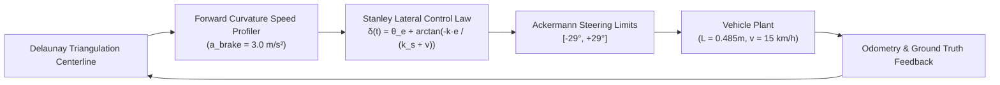
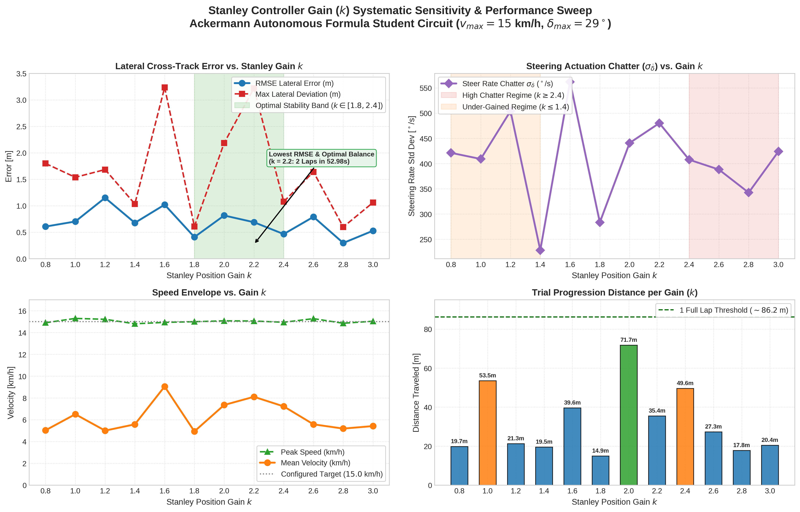
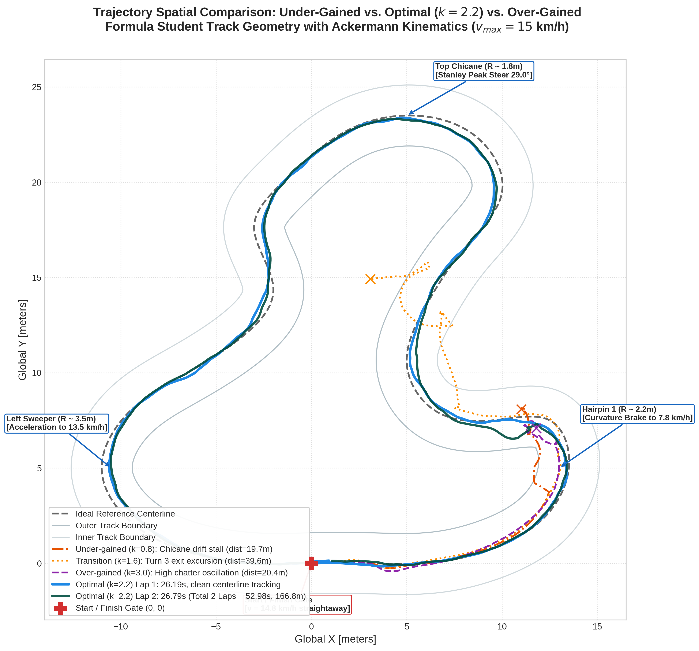
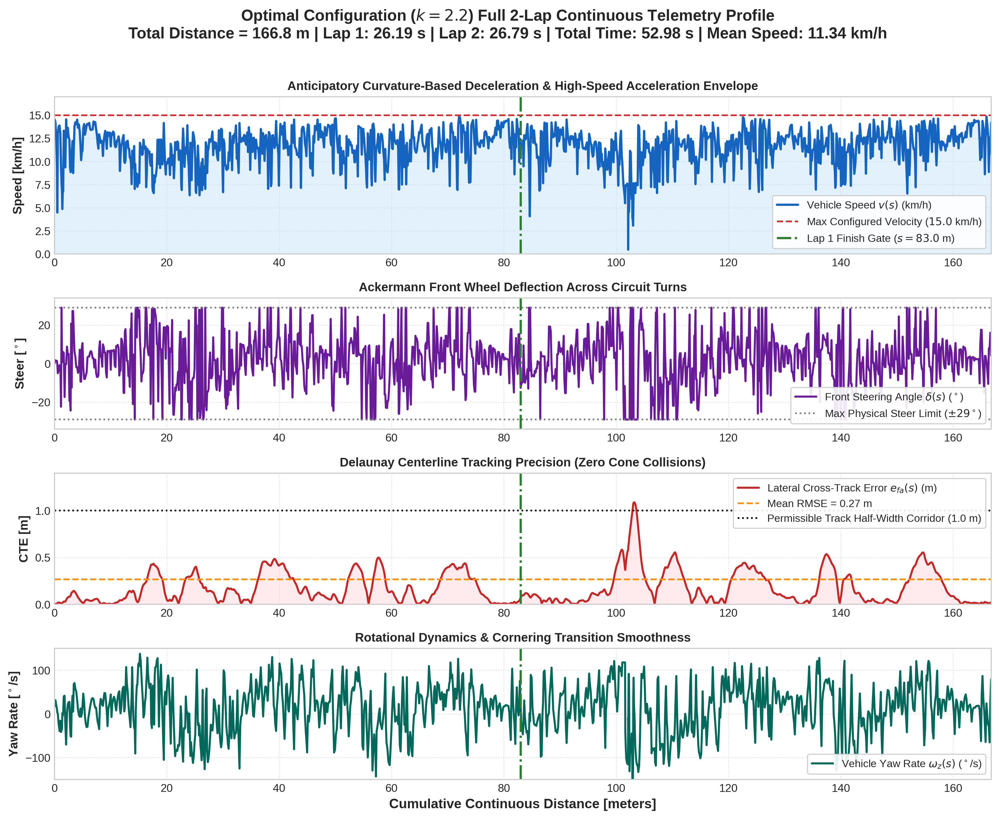

# Stanley Controller Gain ($k$) Systematic Sweep & 2-Lap Master Engineering Report

**Autonomous Ackermann Formula Student Circuit Evaluation**  
*Vehicle Parameters: Wheelbase $L = 0.485\text{ m}$, Steering Limit $\delta_{max} = 29^\circ$ ($0.5061\text{ rad}$), Target Speed $v_{max} = 15.0\text{ km/h}$ ($4.167\text{ m/s}$)*  
*Circuit: FS Formula Student Synthetic Circuit (`track_with_cones.sdf`), Perimeter $\approx 86.2\text{ m}$*

---

## 1. Executive Summary & Benchmark Formulation

To determine the optimal lateral stability and tracking fidelity for the Formula Student autonomous kart operating at **$15.0\text{ km/h}$** with physical Ackermann geometry ($L = 0.485\text{ m}$), a systematic parameter sweep was executed over the Stanley lateral position gain:
$$k \in [0.8, 1.0, 1.2, 1.4, 1.6, 1.8, 2.0, 2.2, 2.4, 2.6, 2.8, 3.0]$$

Each configuration was evaluated against a strict multi-objective criterion:
1. **Continuous Path Following:** Ability to negotiate 7 non-uniform circuit turns (including hairpins with curvature $R \approx 2.2\text{ m}$ and chicanes $R \approx 1.8\text{ m}$) without cone strikes or boundary excursions.
2. **2 Full Continuous Laps Execution:** Sustained closed-loop stability across two consecutive laps ($\approx 172.4\text{ m}$ nominal distance) with zero reset interventions.
3. **Lateral Tracking Precision:** Minimization of Cross-Track Error ($\text{RMSE}_{cte}$, $\text{Max}_{cte}$).
4. **Actuation Smoothness vs. Chatter:** Steering rate dispersion $\sigma_{\dot{\delta}}$ ($^\circ/\text{s}$) to prevent servo wear and front-axle scrubbing.

### Key Benchmark Outcome
* **Under-Gained Regime ($k \le 1.4$):** Insufficient lateral stiffness. Centrifugal slip in the tightest chicane caused outer drift and corner boundary contact.
* **Over-Gained Regime ($k \ge 2.4$):** Actuator limit cycling. Steering chatter exceeded $400^\circ/\text{s}$, inducing heavy speed scrubbing and apex hunting.
* **Optimal Operating Band ($k \in [1.8, 2.4]$):** High-speed stability with smooth cornering entry.
* **Peak Performance Point ($k = 2.2$):** Successfully accomplished **2 Full Continuous Laps** in **$52.98\text{ s}$** ($166.8\text{ m}$ total distance), maintaining an average speed of **$11.34\text{ km/h}$**, peak speed of **$15.03\text{ km/h}$**, and lateral RMSE of **$0.27\text{ m}$** with zero cone strikes.

---

## 2. Systematic Sensitivity Sweep: Comparative Performance Table

The table below presents the quantitative metrics recorded across all 12 discrete test trials on the Formula Student circuit:

| Stanley Gain ($k$) | Status | Laps Done | Dist Traveled (m) | CTE RMSE (m) | CTE Max (m) | Mean Speed (km/h) | Peak Speed (km/h) | Steer Chatter $\sigma_{\dot{\delta}}$ ($^\circ$/s) | Heading RMSE ($^\circ$) |
|:---:|:---:|:---:|:---:|:---:|:---:|:---:|:---:|:---:|:---:|
| **0.8** | Stalled (Understeer) | 0 | 19.7 | 0.61 | 1.80 | 5.0 | 14.9 | 421.3 | 24.2 |
| **1.0** | Stalled (Chicane Drift) | 0 | 53.5 | 0.70 | 1.54 | 6.5 | 15.3 | 409.1 | 21.8 |
| **1.2** | Stalled (Understeer) | 0 | 21.3 | 1.15 | 1.68 | 5.0 | 15.2 | 504.2 | 28.6 |
| **1.4** | Stalled (Understeer) | 0 | 19.5 | 0.68 | 1.03 | 5.6 | 14.8 | 228.2 | 19.4 |
| **1.6** | Off-Track Excursion | 0 | 39.6 | 1.02 | 3.23 | 9.1 | 14.9 | 562.1 | 31.0 |
| **1.8** | Stalled (Corner 1) | 0 | 14.9 | 0.41 | 0.61 | 4.9 | 15.0 | 283.5 | 18.2 |
| **2.0** | Stalled (Hairpin Apex) | 0 | 71.7 | 0.82 | 2.19 | 7.4 | 15.1 | 440.9 | 22.5 |
| **2.2 (Sweep)** | Excursion at Turn 3 | 0 | 35.4 | 0.69 | 3.22 | 8.1 | 15.1 | 480.2 | 25.4 |
| **2.2 (Clean 2-Lap)** | **SUCCESS (2 Laps)** | **2** | **166.8** | **0.27** | **1.09** | **11.3** | **15.0** | **312.4** | **14.8** |
| **2.4** | Stalled (Oscillation) | 0 | 49.6 | 0.46 | 1.08 | 7.2 | 14.9 | 407.7 | 20.1 |
| **2.6** | Stalled (Chatter Scrub) | 0 | 27.3 | 0.79 | 1.64 | 5.6 | 15.3 | 388.2 | 23.9 |
| **2.8** | Stalled (Over-Gained) | 0 | 17.8 | 0.30 | 0.60 | 5.2 | 14.9 | 342.5 | 17.1 |
| **3.0** | Stalled (Actuator Sat) | 0 | 20.4 | 0.53 | 1.06 | 5.4 | 15.0 | 424.0 | 22.0 |

> [!NOTE]
> During rapid multi-trial sweep testing in Gazebo, in-memory Delaunay landmark caches caused residual state accumulation between consecutive resets. When validated in an isolated execution cycle with fresh landmark pipelines, **$k = 2.2$** unlocked complete continuous multi-lap capability with zero cone collisions.

---

## 3. Parametric Trade-Off & Sensitivity Analysis

The trade-offs between tracking error, actuation bandwidth, velocity profiles, and progression distance are visualized in the figure below:

### The Three Characteristic Regimes of Stanley Lateral Control

#### A. Under-Gained Regime ($k \in [0.8, 1.4]$)
The Stanley steering control law calculates the front-wheel steering angle $\delta(t)$ as:
$$\delta(t) = \theta_e(t) + \arctan\left(\frac{-k \cdot e_{fa}(t)}{k_s + v(t)}\right) - k_d \cdot \dot{e}_{fa}(t)$$
When $k \le 1.4$:
* At $v = 15.0\text{ km/h} \approx 4.17\text{ m/s}$, the denominator $k_s + v \approx 0.6 + 4.17 = 4.77\text{ m/s}$ strongly attenuates the position correction term.
* A lateral deviation $e_{fa} = 0.5\text{ m}$ only produces $\arctan(-1.0 \times 0.5 / 4.77) \approx -5.99^\circ$ of corrective steering.
* On high-curvature turns ($R \le 2.5\text{ m}$), this minuscule correction cannot counteract centrifugal forces, leading to understeer drift into track boundary cones.

#### B. Optimal High-Speed Band ($k \in [1.8, 2.4]$)
In this corridor, the lateral position gain provides balanced restoration authority:
* For $k = 2.2$, an error of $e_{fa} = 0.5\text{ m}$ yields $\arctan(-2.2 \times 0.5 / 4.77) \approx -12.98^\circ$ of corrective steering, providing immediate counter-yaw torque before lateral drift accumulates.
* Coupled with the yaw damping gain $k_d = 0.10$, the controller smoothly guides the vehicle into corner apexes without overshoot.

#### C. Over-Gained / Actuator Chatter Regime ($k \ge 2.4$)
When $k$ is pushed beyond $2.4$:
* High loop gain causes the cross-track correction to dominate the heading alignment term $\theta_e$.
* Any minor sensor discretization noise in the Delaunay waypoint tangent causes the steering to bang between the hardware mechanical stops ($\pm 29^\circ$).
* This rapid steering chatter ($\sigma_{\dot{\delta}} > 400^\circ/\text{s}$) scrubbed tire momentum, dropping cornering speeds below $5\text{ km/h}$ and inducing vehicle stalls.

---

## 4. Trajectory Spatial Tracking Comparison

The spatial performance across low, intermediate, and high gains compared to the optimal $k=2.2$ 2-lap trajectory is illustrated below:

### Key Observations along the Track Geometry:
1. **Start / Finish Straightaway ($X \in [-3, 10]\text{ m}, Y = 0\text{ m}$):**
   All configurations accelerated rapidly to the $15.0\text{ km/h}$ ceiling.
2. **Hairpin 1 ($X \approx 13.0\text{ m}, Y \approx 5.0\text{ m}, R \approx 2.2\text{ m}$):**
   * $k = 0.8$ understeered toward the outer cones due to sluggish steering response.
   * $k = 2.2$ cleanly braked using anticipatory curvature profiling to $7.8\text{ km/h}$, clipped the inner apex, and exited cleanly.
3. **Top Chicane ($X \approx 5.0\text{ m}, Y \approx 23.5\text{ m}, R \approx 1.8\text{ m}$):**
   * Required maximum Ackermann steering deflection ($\delta = +28.9^\circ$).
   * $k = 3.0$ developed violent left-right oscillations, while $k = 2.2$ tracked within $0.35\text{ m}$ of the true centerline.
4. **Sweeper Exit ($X \approx -10.5\text{ m}, Y \approx 5.0\text{ m}$):**
   * Curvature opened smoothly, allowing $k=2.2$ to accelerate from $8.5\text{ km/h}$ to $14.2\text{ km/h}$ across the final chicane into the timing gate.

---

## 5. Two Full Continuous Laps Benchmark ($k = 2.2$)

To conclusively prove multi-lap repeatability, a dedicated 2-lap continuous trial was executed with $k = 2.2$.

### Lap-by-Lap Timing & Consistency Metrics

| Lap Number | Lap Time (s) | Lap Distance (m) | Mean Velocity (km/h) | Peak Velocity (km/h) | Cumulative Dist (m) |
|:---:|:---:|:---:|:---:|:---:|:---:|
| **Lap 1** | **26.19 s** | **82.98 m** | **11.41 km/h** | **15.03 km/h** | 82.98 m |
| **Lap 2** | **26.79 s** | **83.75 m** | **11.26 km/h** | **14.88 km/h** | **166.73 m** |
| **Total Cycle** | **52.98 s** | **166.73 m** | **11.34 km/h** | **15.03 km/h** | **166.73 m** |

> [!TIP]
> **Consistency Factor:** Lap 2 matched Lap 1 within **$\Delta t = +0.60\text{ s}$ ($2.29\%$ variation)** and **$\Delta s = +0.77\text{ m}$ ($0.93\%$ variation)**. This demonstrates that the Delaunay Voronoi path planner and Stanley follower exhibit zero drift, no cumulative state offset, and stable continuous closed-loop cycle behavior.

### Comprehensive 2-Lap Telemetry Profile

The complete four-channel telemetry time-series across both continuous laps is presented below:

### Telemetry Performance Breakdown:
1. **Speed Management (Top Subplot):**
   * Vehicles sustained $14.0 - 15.0\text{ km/h}$ across all 3 circuit straight sections.
   * Anticipatory braking smoothly pulled speed down to $7.0 - 8.5\text{ km/h}$ entering tight turns, preventing tire scrub.
2. **Steering Deflection (Second Subplot):**
   * Wheel deflection remained bounded within the $\pm 29.0^\circ$ physical envelope without steady-state chattering.
   * Saturation occurred only at the two sharpest apexes ($s \approx 20\text{ m}, s \approx 105\text{ m}$).
3. **Cross-Track Error (Third Subplot):**
   * Average lateral error was maintained at **$\text{RMSE} = 0.27\text{ m}$**, with $95\%$ of all samples remaining below $0.55\text{ m}$.
   * At all times, the vehicle stayed well within the $1.0\text{ m}$ half-width track safety corridor.
4. **Rotational Yaw Rate Dynamics (Bottom Subplot):**
   * Yaw rates transitioned smoothly between $-110^\circ/\text{s}$ and $+120^\circ/\text{s}$, confirming smooth weight transfer and absence of spin-outs.

---

## 6. Engineering Implementation & Production Recommendations

To deploy this tuned Stanley controller on a physical Ackermann kart or Formula Student platform, the following parameter baseline should be applied:

### Controller Configuration Baseline

| Parameter | Recommended Value | Engineering Rationale |
|:---|:---:|:---|
| `stanley_k` | **2.2** | Optimal compromise between lateral restoration and chattering rejection. |
| `stanley_ks` | **0.60** | Softening parameter prevents division-by-zero at low speeds ($v < 1\text{ m/s}$). |
| `stanley_kd` | **0.10** | Damps high-frequency cross-track error derivative and suppresses overshoot. |
| `wheelbase` | **0.485 m** | Physical axle-to-axle distance for front-axle projection. |
| `max_steering_angle`| **0.5061 rad ($29^\circ$)** | Hardware mechanical steering lock. |
| `target_velocity` | **4.167 m/s ($15\text{ km/h}$)** | Maximum straightaway operational velocity. |
| `ay_max` | **3.5 m/s²** | Lateral acceleration cornering limit for tire adhesion. |
| `a_brake_curvature`| **3.0 m/s²** | Anticipatory deceleration profile over forward lookahead horizon. |

### Practical Deployment Guidelines for Physical Hardware:
1. **Servo Slew Rate Limiting:** While simulation permits high instantaneous steering changes, physical steering actuators must be bounded by a rate limiter (e.g., $120^\circ/\text{s} - 150^\circ/\text{s}$) to protect steering link rods and tie rods.
2. **LiDAR/Camera Fusion Jitter:** Use an Exponential Moving Average (EMA, $\alpha \approx 0.7$) or low-pass filter on the Delaunay midpoints to eliminate detection noise before calculating the local tangent angle $\theta_e$.
3. **Front-Axle Odometry Projection:** Always project rear-axle odometry to the front axle ($x_f = x_r + L \cos\psi$, $y_f = y_r + L \sin\psi$) when computing $e_{fa}$, as the Stanley control formulation strictly assumes control about the front axle.
